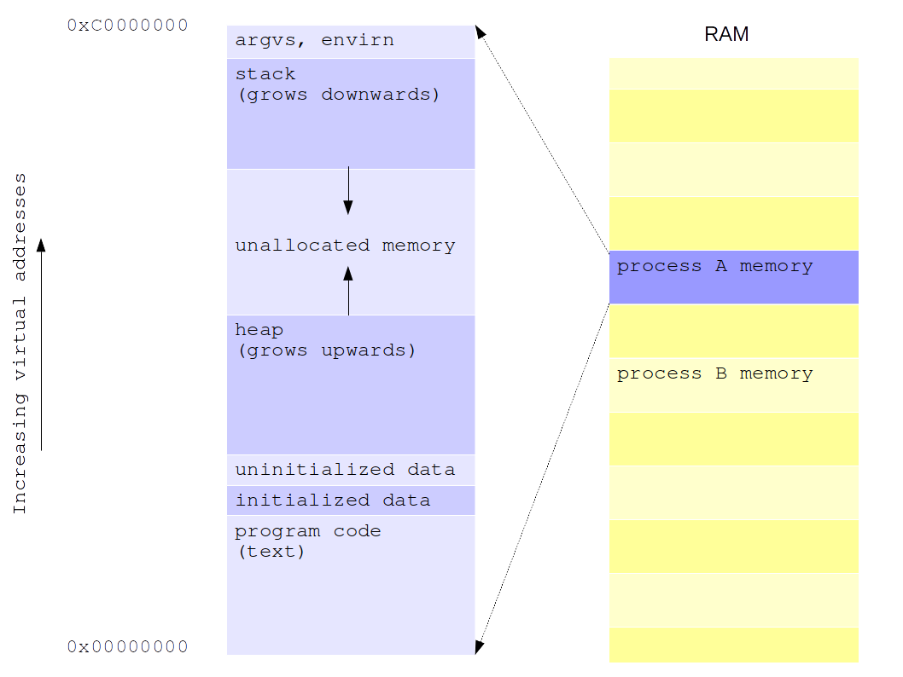

# Processes

# What is a process?

A process is an executing instance of a program. We can view a process as the task of completing all the steps of an algorithm (with a specific input data) whose binary representation exists somewhere in an executable file. To acomplish this, the OS needs to keep some information about the process and a memory image/layout of that process. The former contains information such as process id, process parent id, program counter, etc. The latter includes the code to be executed by the process, environmental information, execution stack, heap, etc. Obviously, the same program can be executed at the same time by different processes. 

# Process information
In order to be able to manage the execution of different processes, several bits of information are required for each existing process (i.e., instances of pgorams in execution). This information vary from operating system to operating system but in the general case should include:

  * Process id (pid), process group, parent process id
  * Process status: running, blocked, waiting, etc (depending on the model followed by the particular OS)
  * Priority 
  * Memory pointers to user address space (we will refer later to this memory as process memory image)
  * Context data/Hardware counters (program counter, stack pointer, floating points registers, etc)
  * Program counter (i.e., memory location of the next instruction to be executed)
  * Accounting information
  * Credentials (user id, group id)
  * Environment variables, although they can be also stored in user address space
  * Other control information (kernel stack, address translation maps)
  * I/O status information (root directory, working directory, file descriptors table)
  * Signaling information (singals to be delivered, etc.)

All that information is stored in a data structure created and maintained by the kernel. That data structure is typically referred to as **process control block (PCB)**. The kernel maintains a table of them to manage all existing processes. This table is usually referred to as **process table**.

*Information on this section has been extracted from William Stallings. "Operating Systems, Internals and Design Principles", Andrew S. Tanembaum, Herbert Bos. "Modern Operating Systems", and Uresh Vahalia. "UNIX Internals, the new frontiers."* 

# Process memory image
In this case the focus is he memory layout/image of a process on Linux. This image is composed of different parts, which in the context of linux are referred to as segments. Different SOs may use different process layouts. In the case of Linux, a process memory layout consists of the following segments:

* Text segment. Instructions of the program to execute (binary code to be executed). This is an only-read segment.
* Initialized data segment (a.k.a. *user-initialized data segment*). Global and static variables initialized explicitely initialized.
* Unitialized data segment (a.k.a. *zero-initialized data segment*). Global and static variables non explicitely initialized. 
* The stack. This segment contains execution stack of the program. Obviously this segment will grow and schrink dynamically due to the program execution (call to functions, finishing the execution of functions, etc.). The stack also stores every variable defined locally within functions.
* The heap. Memory to store data allocate dynamically at runtime (e.g., with `malloc()` or `calloc()`). The top of the heap is called *program break*. 

Every process has the view that it spans over a certain amount of memory (e.g., 4GB or the addressableRAM). Only a few portions of a program are stored in the RAM during the process execution. This is achieve through a technique called **Virtual Memory**. This technique then allow different processes to be *in memory* at the same time (and to share some memory among them!), while still having the impression of span over a bigger amount of memory. For the explanations here it is enough if we assume that every proces span over the whole addressable memory. 

The following picture depicts an abstraction of a process view of the physical memory of the machine.  



*Information on this section has been extracted from Michael Kerrisk. "The Linux Programming Interface"*
# Creating a new process in UNIX
In the UNIX OS a process can be created from an existing process. For that to happen, the existing process executes the system call `fork()`. Usually, the process that executes the `fork()` is referred to as *parent* process, and the process created with `fork()` is called *child process*. The child process is an exact copy of the parent. This means: its memory image is exactly as the in the parent process. When a `fork()` system call is performed, the kernel also created the PCB associated to the new child process. 

After the call to `fork()` any of both the prent process or the child process may be selected by the kernel for execution (indeed any existing process within the kernel can be chosen for execution. The selection depends on many factors (e.g., process priority)). Both parent and child keep exeucting from the next instruction after the fork (therefore, it is a mistake to think that the child process peforms the execution of the program from the beginning). The only difference between parent and child is that the value returned by `fork()` is different in both: for the parent it returns the `pid` of the newly created child. For the child it returns 0. 

The syntax of the fork() is pretty straightforward.
```c
#include <unistd.h>
pid_t fork(void);
```

The following is an example of a program that greets us indicating its `pid` (its process id),  creates a child, and says goodbye to us by also indicating its `pid`. In this example only the parent process greets us, but both, parent and child, say goodbye. 

```c
#include <unistd.h>
#include <stdio.h>

int main(int argc, char **argv) {
	printf("Hi! from %d\n",getpid());
	fork();
	printf("Bye from %d\n",getpid());
}
```

As an alternative to `fork()`, UNIX also provide the system call `vfork()`. This latter reuses the memory image of the original process and is intended only for programs which will perform a call to any form of `execv()` right after the call to `vfork()`. In addition, Linux provides the system call `clone()`, which allows a fine control of what is shared between the parent process and the child process. `clone()` is used also to create execution threads (lightweight process in Linux).

# Relation between processes and files
---


---
After creating a new process with `fork()` this picture illustrate the situation of parent and child processes


As seen, parent and child processes share the same entry on the open files table. This means, they both share the same offset on the file. When one of them writes (with `write()`) the offset will get modified then for both. The next `write()` operation perform by any of the two processes will be relative to the newly set offset. The following code can be executed to illustrate this effect. In this program, a child process is created. Right after creation, the child is somehow forced to leave the CPU by using `sleep()`. The parent process will most probably be chosen for execution within these 5 seconds, writing the "parent" on the file. When the 5 seconds consume, the child will at some point also chosen for execution and will write "child" on the file right after the word parent. 

```c
#include <sys/types.h>
#include <sys/wait.h>
#include <sys/stat.h>
#include <fcntl.h>
#include <stdio.h>
#include <unistd.h>
#include <string.h>
#include <errno.h>

int main(int argc, char **argv) {

	int fd = open("example_file",O_CREAT|O_WRONLY|O_TRUNC,0666);
	if (fd == -1)
		printf("The file example_file couldn't be opened. Error reported: %d\n",errno);

	if (fork()==0) {
		// child code goes here
		sleep(5); // forces the child out of the cpu
		write(fd,"child",strlen("child"));			
	} else {
		// parent code goes here
		write(fd,"parent",strlen("parent"));
		wait(NULL);
	}
	close(fd);
}
```
