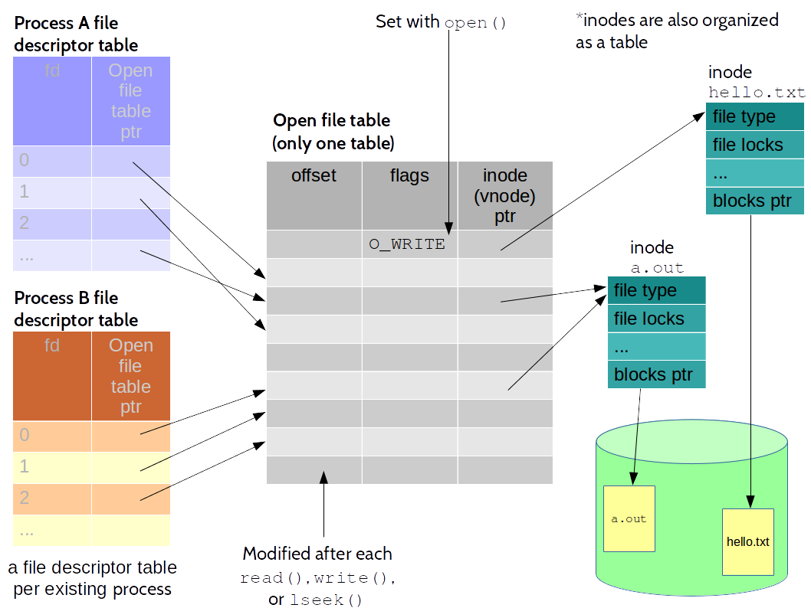

# Processes

# What is a process?

A process is an executing instance of a program. We can view a process as the task of completing all the steps of an algorithm (with a specific input data) whose binary representation exists somewhere in an executable file. To acomplish this, the OS needs to keep some information about the process and a memory image/layout of that process. The former contains information such as process id, process parent id, program counter, etc. The latter includes the code to be executed by the process, environmental information, execution stack, heap, etc. Obviously, the same program can be executed at the same time by different processes. 

# Process information
In order to be able to manage the execution of different processes, several bits of information are required for each existing process (i.e., instances of pgorams in execution). This information varies from operating system to operating system, but in the general case should include most of the following items:

  * Process id (pid), process group, parent process id
  * Process status: running, blocked, waiting, etc (depending on the model followed by the particular OS)
  * Priority 
  * Memory pointers to user address space (we will refer later to this memory as process memory image)
  * Context data/Hardware counters (program counter, stack pointer, floating points registers, etc)
  * Program counter (i.e., memory location of the next instruction to be executed)
  * Accounting information
  * Credentials (user id, group id)
  * Environment variables, although they can be also stored in user address space
  * Other control information (kernel stack, address translation maps)
  * I/O status information (root directory, working directory, file descriptors table)
  * Signaling information (singals to be delivered, etc.)

All that information is stored in a data structure created and maintained by the kernel. That data structure is typically referred to as **process control block (PCB)**. The kernel maintains a table of them to manage all existing processes. This table is usually referred to as **process table**.

*Information on this section has been extracted from William Stallings. "Operating Systems, Internals and Design Principles", Andrew S. Tanembaum, Herbert Bos. "Modern Operating Systems", and Uresh Vahalia. "UNIX Internals, the new frontiers."* 

# Process memory image
In this case the focus is he memory layout/image of a process on Linux. This image is composed of different parts, which in the context of linux are referred to as segments. Different SOs may use different process layouts. In the case of Linux, a process memory layout consists of the following segments:

* Text segment. Instructions of the program to execute (binary code to be executed). This is an only-read segment.
* Initialized data segment (a.k.a. *user-initialized data segment*). Global and static variables initialized explicitely initialized.
* Unitialized data segment (a.k.a. *zero-initialized data segment*). Global and static variables non explicitely initialized. 
* The stack. This segment contains execution stack of the program. Obviously this segment will grow and schrink dynamically due to the program execution (call to functions, finishing the execution of functions, etc.). The stack also stores every variable defined locally within functions.
* The heap. Memory to store data allocate dynamically at runtime (e.g., with `malloc()` or `calloc()`). The top of the heap is called *program break*. 

Every process has the view that it spans over a certain amount of memory (e.g., 4GB or the addressableRAM). Only a few portions of a program are stored in the RAM during the process execution. This is achieve through a technique called **Virtual Memory**. This technique then allow different processes to be *in memory* at the same time (and to share some memory among them!), while still having the impression of span over a bigger amount of memory. For the explanations here it is enough if we assume that every proces span over the whole addressable memory. 

The following picture depicts an abstraction of a process view of the physical memory of the machine.  


*Information on this section has been extracted from Michael Kerrisk. "The Linux Programming Interface"*
# Creating a new process in UNIX
In the UNIX OS a process can be created from an existing process. For that to happen, the existing process executes the system call `fork()`. Usually, the process that executes the `fork()` is referred to as *parent* process, and the process created with `fork()` is called *child process*. The child process is an exact copy of the parent. This means: its memory image is exactly as the in the parent process. When a `fork()` system call is performed, the kernel also created the PCB associated to the new child process. 

After the call to `fork()` any of both the prent process or the child process may be selected by the kernel for execution (indeed any existing process within the kernel can be chosen for execution. The selection depends on many factors (e.g., process priority)). Both parent and child keep exeucting from the next instruction after the fork (therefore, it is a mistake to think that the child process peforms the execution of the program from the beginning). The only difference between parent and child is that the value returned by `fork()` is different in both: for the parent it returns the `pid` of the newly created child. For the child it returns 0. 

The syntax of the fork() is pretty straightforward.
```c
#include <unistd.h>
pid_t fork(void);
```

The following is an example of a program that greets us indicating its `pid` (its process id),  creates a child, and says goodbye to us by also indicating its `pid`. In this example only the parent process greets us, but both, parent and child, say goodbye. 

```c
#include <unistd.h>
#include <stdio.h>

int main(int argc, char **argv) {
	printf("Hi! from %d\n",getpid());
	fork();
	printf("Bye from %d\n",getpid());
}
```

As an alternative to `fork()`, UNIX also provide the system call `vfork()`. This latter reuses the memory image of the original process and is intended only for programs which will perform a call to any form of `execv()` right after the call to `vfork()`. In addition, Linux provides the system call `clone()`, which allows a fine control of what is shared between the parent process and the child process. `clone()` is used also to create execution threads (lightweight process in Linux).

# Relation between processes and files
---


---

After creating a new process with `fork()` this picture illustrate the situation of parent and child processes


As seen, parent and child processes share the same entry on the open files table. This means, they both share the same offset on the file. When one of them writes (with `write()`) the offset will get modified then for both. The next `write()` operation perform by any of the two processes will be relative to the newly set offset. The following code can be executed to illustrate this effect. In this program, a child process is created. Right after creation, the child is somehow forced to leave the CPU by using `sleep()`. The parent process will most probably be chosen for execution within these 5 seconds, writing the "parent" on the file. When the 5 seconds consume, the child will at some point also chosen for execution and will write "child" on the file right after the word parent. 

```c
#include <sys/types.h>
#include <sys/wait.h>
#include <sys/stat.h>
#include <fcntl.h>
#include <stdio.h>
#include <unistd.h>
#include <string.h>
#include <errno.h>

int main(int argc, char **argv) {

	int fd = open("example_file",O_CREAT|O_WRONLY|O_TRUNC,0666);
	if (fd == -1)
		printf("The file example_file couldn't be opened. Error reported: %d\n",errno);

	if (fork()==0) {
		// child code goes here
		sleep(5); // forces the child out of the cpu
		write(fd,"child",strlen("child"));			
	} else {
		// parent code goes here
		write(fd,"parent",strlen("parent"));
		wait(NULL);
	}
	close(fd);
}
```
---
Existing file descriptors can be duplicated within a process. This can be achieved by using any of the two system calls.
```c
int dup(int fd);
int dup2(int fd,int fd2);
```
The first variant of `dup()` (with only one argument) returns the number of the file descriptor that points to the same entry in the open file table as the used argument. The returned file desciptor is the lowest-numbered desciptor still available. The second variant, `dup2()`, allows indicating the number of the file descriptor  we want to point to the same entry in the open file table as the first argument. If this descriptor belongs to an open file, the function closes the file for us before the duplication. The following image depicts the process status after performing a call to `dup(1)`.


The same net effect can be achieved by using the function `fcntl()` instead of `dup()` or `dup2()`. See bellow:
```c
dup(fd);
```
is equivalent to 
```c
fcntl(fd,F_DUPFD,0);
```
The same way
```
dup2(fd,fd2);
```
is similar to 
```c
close(fd2);
fcntl(fd,F_DUPFD,fd2);
```
In this latter case it is important to highlight that the example is similar and not equivalent. `dup2()` performs its operation atomically while closing a descritor followed by the call to `fcntl()` is not atomic. 

The following shows an example of how the output of a process can be redirected to a file (e.g., what happens for example when you perform `command > redirection_file`). For brevity reasons this program focuses only on the redirection a ommit anything else. 

```c
#include <sys/types.h>
#include <sys/stat.h>
#include <fcntl.h>
#include <unistd.h>
#include <stdio.h>


// Idea: what is written in the file descriptor 1 (STDOUT)
// should go to the file, not to the standard output

int main(int argc, char** argv) {

	int fd_file=open("redirection_file",O_CREAT|O_TRUNC|O_RDWR, 0666);
	if (!fd_file) {
		perror("Error when opening the redirection_file");
		_exit(-1);
	} 

	//we perform the redirection

	//dup2 first closes STDOUT and then it makes STDOUT to point to the same
	//entry in the file open talbe as fd_file (this is done atomically)
	dup2(fd_file,STDOUT_FILENO); 

	//we close fd_file since we are not going to use it directly since
	//the file descriptor STDOUT points now to the file fd_file points
	close(fd_file);

	//we perform now some tests
	printf("Without redirection this message should appear on the terminal\n");
	printf("As we are redirecting to a file, if you are reading this, then\n");
	printf("you are reading the file redirection_file\n");

  //printf is buffered
	fflush(stdout);
	
}
```

The following picture illustrates what happens in the code above. 


# Signals

Signals are the most basic interpocess communication form in UNIX. Singals are usually send to processes for indicating an envent has happened. In some context signals ar referred to as "software interrupts". The reason is that upon receiving a signal, a process jumps into executing a specific function for dealing with the signal. Once that function has been executed, the process keeps executiong the next instruction that would have executed if the signal would have not arrived. 

Signals can be sent from one process to another, from one process to itself, or from the kernel to a process. Examples of when signals are sent to a process are:

* when the user types _cntrl+c_
* after setting an alarm
* aftera child process has finished
* etc

A process can send a signal to another process using the system call `kill()`. 
When a process receives a signal, it can:

* ignore the signal
* finish its execution
* resume its execution if stopped
* call a specific function for dealing with that signal and afteward keep the execution 

Every signal has associated a different integer number and a name, which typically starts with the prefix SIG. Signals are defined in the header `<signal.h>`.

## How to work with signals

A signal is generated by an event or due to a process call to `kill()` and is delivered to a process. By default, there is an action associated with each signal. This action may be different for different signals. It is up to the user to check what is the default option associated with every signal. 

A program can also change the default behaviour for every signal (i.e., when the signal is received, instead of the default behavior the program can do something else). Usually this default behaviour is a particular function within the source code of the program. In the context of signals this function is referred to as _signal handler_ or simply _handler_. 

Unix provides several system calls that allow to change the specific behavior of a signal. One of these system calls is `signal()`. Despite its name it does not create or send a signal. It just indicates that upon receiving a particular signal a given function will be executed instead of the default behavior. The complete signature is as follows

```c
void (*)(int) signal(int signumber, void (*handler)(int));
```

The parameters are two. Firstly, the number of the signal for what we want to change the behaviour. Second, a function that receives an integer and returns void. This function will be called when the signal is received using as argument the number of that signal. The function returns a pointer to a function that receives an integer and returns void. This function is the one containing the previous behavior for the signal. Either the default one or the one used in the previous call to signal. 

As example, we are going to modify a program in such a way that instead of finishing when we press the combination of keys _ctrl+c_ the program prints a message on the screen. To create this program it is important to know what happens when a user press `ctrl+c` on an executing program. When this happens, the kernels send the process that executes that program the signal `SIGINT`. The default behaviour of this signal is to terminate the program. If we want to do something else we have to specify this behaviour (in this case with a call to `signal()`). The following code implements this. 

```c
#include <signal.h>
#include <stdio.h>

void signal_handler(int signalNumber) {
        printf("I do not finish when you hold ctr+c down. Make me finish using another method\n");
}

int main(int argc, char** argv) {
        void (*previous_handler)(int);
        previous_handler = signal(SIGINT,signal_handler);

        while (1) {;} // do something useful here; this is just an example!

}
```

Using `signal()` has however some limitations we will analyse soon. Therefore, instead of using `signal()` it is preferible to use `sigaction()`. 
